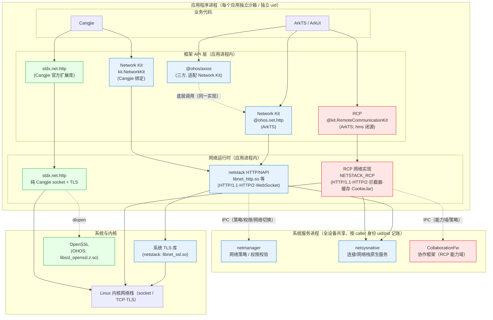
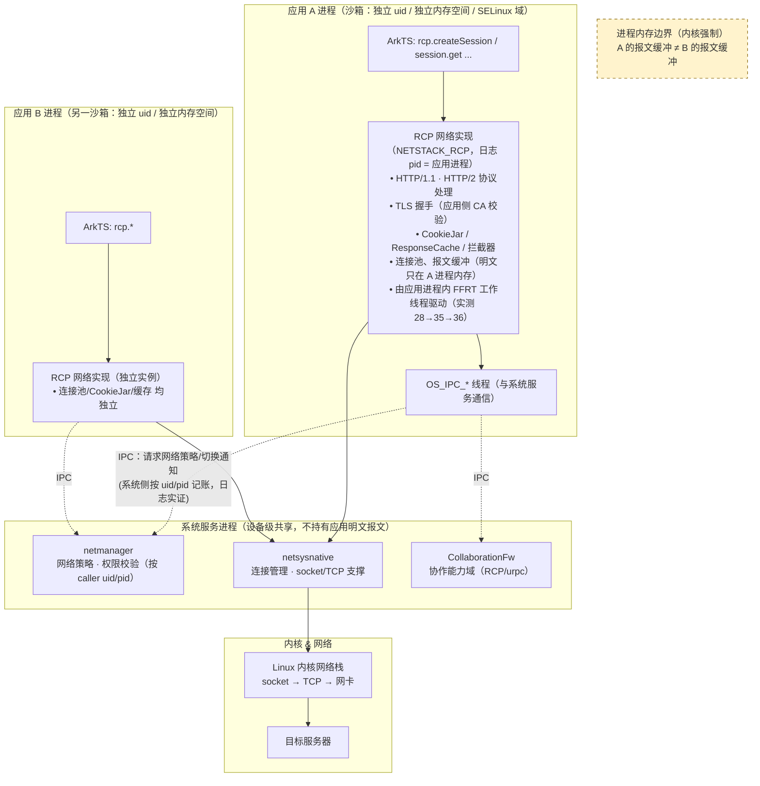

# 鸿蒙网络库技术对比（Network Kit / RCP / Axios / stdx.net.http）

> 本文档梳理 HarmonyOS 上可用的四类 HTTP 客户端方案的**定位、生态、技术原理、优缺点、
> 约束与限制**（共 5 套 API：Network Kit 的 ArkTS 与 Cangjie 两套绑定各算一套，
> 其余为 RCP、`@ohos/axios`、`stdx.net.http`），并给出两张架构图：
> 图 1 技术总览；图 2 RCP 的进程/内存/隔离架构。
>
> 结论来源：本仓库端到端实测（`COMPARISON.md`、`mock-server/`、`network-compare/`、
> `cj-network-compare/`）+ HarmonyOS/OpenHarmony SDK 逆向与模拟器进程级观察
> （详见文末「证据来源」）。

## 目录

1. [定位速览](#1-定位速览)
2. [架构图：技术总览](#2-架构图技术总览)
3. [逐框架详解](#3-逐框架详解)
   - [3.1 Network Kit（ArkTS）](#31-network-kitarkts)
   - [3.2 Network Kit（Cangjie）](#32-network-kitcangjie)
   - [3.3 RCP（Remote Communication Kit）](#33-rcpremote-communication-kit)
   - [3.4 @ohos/axios](#34-ohosaxios)
   - [3.5 stdx.net.http（Cangjie）](#35-stdxnethttpcangjie)
4. [架构图：RCP 的进程、内存与隔离](#4-架构图rcp-的进程内存与隔离)
5. [隔离与安全：会不会泄露数据？](#5-隔离与安全会不会泄露数据)
6. [选型建议](#6-选型建议)
7. [证据来源与验证方法](#7-证据来源与验证方法)

---

## 1. 定位速览

| 维度 | Network Kit (ArkTS) | Network Kit (Cangjie) | RCP | @ohos/axios | stdx.net.http |
|---|---|---|---|---|---|
| **归属** | OpenHarmony 开源子系统（`communication_netstack`） | 同上（Cangjie 绑定，`kit.NetworkKit` 重导出 `ohos.net.http`） | **HarmonyOS 闭源**（hms SDK，`Collaboration` 能力域） | 三方库（社区维护），**适配** Network Kit | Cangjie 官方扩展标准库（`cangjie_stdx`，开源） |
| **API 形态** | ArkTS，异步（Promise/Callback） | Cangjie，异步（`AsyncCallback`） | ArkTS（+ NDK C API `rcp.h`），异步 | ArkTS，Promise（axios 风格） | Cangjie，**同步阻塞** |
| **平台** | 仅 HarmonyOS/OpenHarmony | 仅 HarmonyOS（Cangjie 目标） | **仅 HarmonyOS**（hms 闭源） | 仅 HarmonyOS | **跨平台**：Linux / macOS / Windows / OHOS |
| **底层实现** | netstack（应用进程内）+ netmanager 系统服务（策略） | 同 ArkTS 版（同一实现） | 闭源实现（应用进程内执行 HTTP/TLS，见 §4） | **调用 Network Kit**（`@ohos.net.http`） | 纯 Cangjie socket + TLS（OpenSSL dlopen） |
| **Cookie** | 手动（`response.cookies` 为 Netscape 格式） | 手动（同上） | ✅ `CookieRepository` 自动 | 手动（不透出 cookies 字段） | ✅ 内置 `CookieJar`（默认启用） |
| **Cache/ETag** | ⚠️ `usingCache` 实测未命中/不发 If-None-Match（另有显式 API `createHttpResponseCache()`，本仓库未覆盖） | 同 ArkTS 版 | ✅ `ResponseCache`（max-age 命中、304 复用） | ❌ 无缓存层 | ❌ 无缓存 |
| **REST 方法** | 无 PATCH 枚举；`customMethod`（@since 23）可传 `'PATCH'` | **无 PATCH 且无 customMethod**（编译器验证） | ✅ 任意 `HttpMethod` | ✅（`.d.ts` 缺 `patch`，用 `request({method:'PATCH'})`） | ✅ 任意 method 字符串 |
| **可观测性** | `connectionExtraInfo`（协议名/isCacheHit） | ❌ 无 `connectionExtraInfo` | `httpVersion`/`cacheInfo`/`tracing` | ❌ 仅 `performanceTiming` | `rsp.version`（协议可读） |
| **网络安全配置遵循** | ✅ trust-anchors + 明文管控 | ✅ 同 ArkTS 版 | ❌ 不遵循应用级 trust-anchors；明文管控需显式配置 | ✅（跟随 net.http） | ❌ 原生 socket，**不经过**系统管控 |
| **生态成熟度** | 高（系统 API，文档全） | 中（Cangjie Beta，API 面窄） | 中（华为主推，闭源、跨设备协同定位） | 高（JS 生态习惯，但适配层有限） | 低（需自编译、无预编译 OHOS 资产） |

---

## 2. 架构图：技术总览



**读图要点**：

- **层次**：所有框架的**业务 API + 网络执行**都在**应用进程内**（`API` 与 `RT` 两层同属 `APP`
  进程）；系统服务进程（`SYS`）只提供**网络策略、权限校验、连接管理**等支撑能力，通过 IPC
  被调用——**不代理应用层 HTTP 报文**（实证见 §4/§5）。
- **平台归属**：
  - **Network Kit**（含 Cangjie 绑定）与 **Axios** 属于 OpenHarmony 开源栈，**仅 HarmonyOS**；
  - **RCP** 属华为闭源协作能力域（`Collaboration`），**仅 HarmonyOS**；
  - **stdx.net.http** 是 Cangjie 官方扩展库，**跨平台**（Linux/macOS/Windows/OHOS），
    在 OHOS 上通过 dlopen 系统 OpenSSL 实现 TLS——这也解释了它在本工程模拟器上
    HTTPS 不可用（运行时加载不到该库，见 §3.5）。
- **Axios 的位置**：它是**应用进程内的 JS 适配层**，最终仍走 Network Kit——因此它继承
  Network Kit 的全部网络行为（header 小写化、明文管控、trust-anchors、无缓存等），
  只额外提供 axios 风格 API（拦截器、自动 JSON 解析）。

---

## 3. 逐框架详解

### 3.1 Network Kit（ArkTS）

**定位**：HarmonyOS **系统级 HTTP/WebSocket 基础能力**，OpenHarmony 开源子系统
`foundation/communication/netstack` 的北向 API（`@ohos.net.http`，聚合导出为
`@kit.NetworkKit`）。是应用做 HTTP 请求的"默认选择"。

**生态**：系统 API、文档与示例最完整；被大量三方库（axios、部分请求封装库）作为底层使用。

**技术原理**：
- API 层：ArkTS 声明（`js-apis-http.d.ts`）→ NAPI（`frameworks/js/napi/http`）
- 执行层：应用进程内的 native HTTP 实现（`libnet_http.so` / `libnet_ssl.so` /
  `libnet_websocket.so`），日志域 `NETSTACK`（实测 pid = 应用进程）
- 支撑层：`netmanager`（策略/权限，如 `GET_NETWORK_INFO` 校验）、`netsysnative`（连接/网络栈）
- TLS：`libnet_ssl.so`（系统库，应用进程内完成握手）

**优点**：
- 官方系统 API：无需额外依赖、随系统升级、权限与策略天然对齐（明文管控、trust-anchors 生效）
- 覆盖面全：HTTP/1.1、HTTP/2（显式 `usingProtocol`）、WebSocket、TLS socket、证书固定
- 可观测性：`connectionExtraInfo`（`@since 24`）暴露协议版本、`isCacheHit`
- ArkTS 与 Cangjie 两套绑定，行为一致（本仓库已验证）

**缺点/限制**（本仓库实测）：
- **Cookie 需手动**：`response.cookies` 是 **Netscape cookie-file 格式**（tab 分隔），
  要自己解析并回填 `Cookie` header，无 cookie jar
- **`usingCache` 实测无效**：`usingCache` 默认 `true`，但实测 max-age 缓存**未命中**
  （服务端计数 delta=2）、**不发 `If-None-Match`**（ETag 304 复用完全未发生）。
  注意 Network Kit **另有显式缓存 API** `http.createHttpResponseCache(cacheSize?)`
  返回 `HttpResponseCache`——默认 `usingCache` 路径未生效不等于框架无缓存能力，
  这是本项目**尚未覆盖的实验维度**（见 `COMPARISON.md` 的说明）
- **Header 名被小写化**：HTTP/1.1 下发送即转小写（与 RCP 的"保留原大小写"相反）
- **`RequestMethod` 无 `PATCH` 成员**（枚举只有 OPTIONS/GET/HEAD/POST/PUT/DELETE/TRACE/CONNECT）。
  变通：`HttpRequestOptions.customMethod?: string`（**`@since 23`**，API 24 可用）可传
  `'PATCH'`——**但 Cangjie 绑定没有 `customMethod`**（见 §3.2）
- **错误模型偏底层**：`BusinessException` + 数字错误码（如 2300997 明文被禁）

### 3.2 Network Kit（Cangjie）

**定位**：Cangjie（仓颉）语言对 Network Kit 的**官方绑定**——`import kit.NetworkKit.*`
实际重导出 `ohos.net.http.*`。Cangjie 应用做 HTTP 的**唯一系统级选择**（RCP 无 Cangjie 绑定）。

**生态**：Cangjie API 24（Beta），绑定覆盖 HTTP 主要能力，但 API 面比 ArkTS 窄；
Cangjie 侧生态尚早（无 axios 类三方库）。

**技术原理**：与 ArkTS 版**同一个 native 实现**（netstack），仅语言绑定不同。
调用仍是异步回调：`req.request(url, option) { err, resp => ... }`；回调在**后台线程**执行。

**优点**：
- 与 ArkTS 版**行为完全一致**（本仓库 11 场景逐项对齐：缓存未命中、无 If-None-Match、
  header 小写化、Netscape cookie 格式、trust-anchors/明文管控生效）
- 支持 `caPath`（bundle 内 PEM 路径）做代码级 CA 信任；`HttpData.ArrayData` 支持二进制；
  `multiFormDataList` 支持 multipart

**缺点/限制**（实测 + 编译器验证）：
- **无 `RequestMethod.Patch`，且无 `customMethod`** → **PATCH 无法发送**。
  已用 OHOS 目标编译器逐条验证（见 §7「编译器级验证」）：
  `'Patch' is not a member of enum 'RequestMethod'`、
  `'customMethod' is not a member of enum 'RequestMethod'`
- **无 `connectionExtraInfo`** → 客户端读不到协议版本/是否命中缓存，只能靠服务端回显/计数
  （编译报错：`'connectionExtraInfo' is not a member of class 'HttpResponse'`）
- **只有 `caPath`（文件路径），无 `caData`（内存 PEM）**：`caData` 虽然在
  `ohos.net.http.cjo` 的接口元数据里存在（类型 `Option<String>`），但**对 Cangjie
  调用方不可见**，构造重载里也没有它（190 个 `init` 重载均无 `caData`）；
  赋值会被编译器拒绝：`can not access field 'caData'` / `undeclared identifier 'caData'`
- multipart 必须**显式设** `Content-Type: multipart/form-data`，否则服务端收到 partCount=0
- 无 JSON 库（需手写或引三方），无 `substring` 等便利 API，语言绑定仍在 Beta
- **回调线程模型有坑**：网络回调在后台线程，直接写 `@State` 会崩（`[MTHRD1433]`），
  需用 `launch()` 调度回主线程

### 3.3 RCP（Remote Communication Kit）

**定位**：华为在 HarmonyOS 上主推的**新一代应用级网络框架**。SDK 中
`hms/ets/kits/@kit.RemoteCommunicationKit.d.ts` 只是 11 行的转发壳（重导出
`@hms.collaboration.rcp` 与 `@hms.collaboration.urpc`），**真实 ArkTS API 声明在
`hms/ets/api/@hms.collaboration.rcp.d.ts`**（约 7360 行）。能力域为
`SystemCapability.Collaboration.RemoteCommunication`（**协作/远程通信**，而非 Network 子系统）。
定位是"更现代的应用级 HTTP 客户端"：会话、连接池、拦截器、缓存、CookieJar 一体化。

**生态**：华为官方主推（Best Practices 有专门指南）、闭源；ArkTS API（API 11+）与
NDK C API（`librcp_c.so` + `rcp.h`，API 12+）。**无 Cangjie 绑定**。

**技术原理**（本仓库逆向 + 模拟器实证）：
- ArkTS API（`@hms.collaboration.rcp`）→ 应用进程内的 native 实现
- SDK 里 `librcp_c.so` 是 **6.3 KB 的符号 stub**（导出符号全部为 `ret` 空实现）——
  编译期提供链接符号，**运行期由设备系统库/服务提供真实实现**
- 实测日志域 **`NETSTACK_RCP`**，日志 **pid = 应用进程**（与 Network Kit 的 `NETSTACK`
  同段）——**HTTP/TLS 执行发生在应用程序进程内**，不是独立进程代理
- `CollaborationFw` 系统进程（协作框架）与 RCP 能力域相关，但 HTTP 报文不经过它转发
- 与 `netmanager` / `netsysnative` 通过 IPC 交互做策略/连接管理

**优点**（实测）：
- **CookieRepository 自动管理** cookie（对比 Network Kit/Axios 需手动）
- **ResponseCache 真正生效**：max-age 命中缓存、ETag 条件请求 `If-None-Match → 304 → 复用缓存`
- **保留 header 原始大小写**（HTTP/1.1）
- 任意 `HttpMethod`（含 PATCH；`.d.ts` 里 `HttpMethod` 还允许任意字符串）
- 工程化能力齐备（`SessionConfiguration`）：`interceptors`（拦截器链）、
  `connectionConfiguration`、`cacheControl`（`maxAge`/`noCache`/`noStore`/`expirationPolicy`）、
  `cookieRepository`、`baseAddress`、`sessionListener`、`tracing`（`TracingConfiguration`）
- 可观测性完整：响应上 `readonly httpVersion`（`'1.0'|'1.1'|'2'|'3'|'unknown'`）与
  `readonly cacheInfo`

**缺点/限制**：
- **闭源、仅 HarmonyOS**（无 OpenHarmony 开源实现，模拟器/真机之外的平台不可用）
- **不遵循应用级 `network_config.json` trust-anchors**：必须代码级
  `remoteValidation`（`'system' | 'skip' | CertificateAuthority | ValidationCallback`）
  指定 CA（本仓库实测：同一配置下 Network Kit 成功、RCP 报 SSL 证书错误）；
  `CertificateAuthority` 支持 `content`（PEM 字符串/ArrayBuffer）、`filePath`、`folderPath`
- **明文管控需显式配置**：`component-config."Remote Communication Kit"` 默认 **false**
  （不受控），全局禁明文时 RCP 默认仍可发明文，需手动置 true 才与 Network Kit 对齐
- **无 Cangjie 绑定**（Cangjie 应用无法使用）
- **无协议版本选择能力**：API 24 的 `@hms.collaboration.rcp.d.ts` 中
  **不存在**会话级/请求级 HTTP 版本开关（如 `httpVersionSelectCallback`），
  也没有 `usingProtocol` 之类的入口——只能由框架自动协商，再用响应的
  `httpVersion` **读回**结果。需要"强制 HTTP/1.1 或 HTTP/2"时 RCP 无法满足
  （Network Kit 可显式 `usingProtocol`）

### 3.4 @ohos/axios

**定位**：OpenHarmony 社区维护的 **axios 适配版**（`@ohos/axios`），让习惯 Web 前端
axios 的开发者以同样 API 在鸿蒙发请求。**不是独立网络栈**。

**生态**：JS/TS 生态习惯迁移成本低（拦截器、`then/catch`、`baseURL`、`timeout`），
但仅此一层适配，社区规模远小于 Web 端 axios。

**技术原理**（本仓库源码级验证，`oh_modules/.ohpm/@ohos+axios@2.2.13`）：
- 适配器 `src/main/ets/components/lib/adapters/ohos/http.js` 直接
  `import _http from '@ohos.net.http'` → `_http.createHttp()` → `httpRequest.request(url, options, cb)`
  ——**底层就是 Network Kit**，因此**网络行为继承 Network Kit**（header 小写化、
  明文管控、trust-anchors、无缓存、无 If-None-Match）
- 它会把 axios 配置翻译成 `HttpRequestOptions`：`method: config.method.toUpperCase()`、
  `header`、`readTimeout`/`connectTimeout`、`expectDataType`、
  **透传 `config.usingProtocol`**（第 355 行）、**透传 `config.caPath`**（第 306 行）；
  但**不设置 `usingCache`**（即走 Network Kit 默认值）
- 响应对象只映射 6 个字段（`http.js` 第 65-73 行）：
  `data: data.result`、`status: data.responseCode`、`statusText: ''`、
  `headers: data.header`、`performanceTiming`，外加 `config`/`request`

**优点**：
- axios 风格 API（拦截器、自动 JSON 解析、`validateStatus` 等）开箱可用
- 习惯 Web 开发的团队迁移成本低；底层复用系统栈，权限/策略自动对齐

**缺点/限制**（实测 + 源码级验证）：
- **响应字段被裁剪**：适配器只映射上列 6 个字段 →
  `response.cookies`、`connectionExtraInfo`（协议版本 / `isCacheHit`）**都拿不到**
- **无缓存/ETag 层**：适配器从不设置 `usingCache`；`AxiosRequestConfig.cache`
  在 `.d.ts` 里声明为 `any`，本包适配器**未使用**（包内出现的 `cacheDir`
  只用于文件下载的临时目录，与 HTTP 缓存无关）
- **默认拒绝 304**：`validateStatus` 默认只接受 2xx，服务端回 304 会 reject
- **Cookie 手动**：需从 `resp.headers.get('set-cookie')` 自行解析回填
- **ArkTS 严格模式摩擦**：泛型必须写全三个类型参数；2.2.13 的 `Axios` 接口
  **没有 `patch()` 方法**（只有 `postForm`/`putForm`/`patchForm`）——
  虽然 `AxiosRequestConfig.method` 的联合类型里含 `'patch' | 'PATCH'`，
  但发 PATCH 只能写 `request({ method: 'PATCH' })`
- 库自身 `.d.ts` 大量 `any`（业务代码不能出现 `any`）

### 3.5 stdx.net.http（Cangjie）

**定位**：Cangjie **官方扩展标准库**（`cangjie_stdx` 的 `net.http` 包）——纯仓颉实现的
HTTP/1.1 + HTTP/2 + WebSocket **客户端与服务端**。不是鸿蒙系统能力，而是**跨平台**的
Cangjie 生态库（Linux/macOS/Windows/OHOS）。

**生态**：Cangjie 官方仓库（gitcode `Cangjie/cangjie_stdx`），有官方 release（按
cjc 版本 + 平台发布预编译资产）、cjpm 包结构（v1.1.3.1 起根含 `cjpm.toml`）、
官方源码依赖指南与 `setup_stdx.py` 安装工具。**但 OHOS 平台资产尚未发布**
（release 只有 android/linux/mac/windows）。

**技术原理**：
- **同步阻塞 API**：`ClientBuilder().build()` → `client.get(url)` / `client.send(req)`
  返回 `HttpResponse`（body 是 `InputStream`）
- 纯 Cangjie 实现：TCP socket + TLS（`stdx.net.tls`，通过 **dlopen 系统 OpenSSL**）
  源码中按平台选库名（`src/stdx/dynamicLoader/opensslSymbols.c`）：
  OHOS → `libcrypto_openssl.z.so` / `libssl_openssl.z.so`；
  macOS → `libcrypto.3.dylib` / `libssl.3.dylib`；Windows → `libcrypto-3-x64.dll`；
  其余 Linux → `libcrypto.so.3` / `libssl.so.3`
- native 部分（OpenSSL FFI 绑定、压缩等）用 CMake + build.py 预构建
- **内置 `CookieJar`（默认启用）**：`ClientBuilder.cookieJar(...)` 可注入自定义实现，
  不注入时用 `CookieJarImpl`，客户端在响应侧 `resolveCookie` 存 cookie、请求侧
  `setCookie` 自动回填 `Cookie` 头（源码 `client.cj`）
- 支持 HTTP/2（TLS + ALPN `h2`）、gzip、WebSocket（客户端与服务端）

**优点**：
- **跨平台**（同一份代码可在 Linux/macOS 跑）；纯 Cangjie、无 ArkTS 依赖
- **同步 API 易写**（对比 Network Kit/RCP 的异步回调，串行多个请求很直观）
- **任意 method 字符串**（PATCH 可用）；`rsp.version` 直接读协议版本；
  header 多值访问；`Set-Cookie` 是**标准 `name=value;` 格式**
- **Cookie 自动管理**（内置 CookieJar 默认开启，无需像 Network Kit 那样手工解析
  Netscape 格式）
- 可作为服务端 HTTP 库（唯一同时提供 server 能力的方案）

**缺点/限制**（本仓库实测 + 调研）：
- **OHOS 无预编译资产**：必须本地交叉编译（需 OpenSSL 头文件、ninja、cmake、DevEco toolchain）
- **HTTPS 在模拟器不可用**：TLS 靠 dlopen 系统 OpenSSL，而模拟器运行时**加载不到**
  该库（`cj-network-compare` 的 stdx HTTPS 场景实测抛
  `TlsException: Can not load openssl library or function CRYPTO_get_ex_new_index`）。
  ⚠️ 注意：shell（uid 2000）读不了 `/system/lib64/`（`Permission denied`），
  因此**无法直接列目录确认该库是否存在**——"缺失"这一判断来自运行时异常，
  而非目录枚举。真机是否可用取决于系统是否自带该库，接入前必须在目标真机验证
- **同步 API 阻塞调用线程**：UI 线程直接调用会卡界面，必须放后台线程
- **不遵循系统网络管控**：原生 socket 实现，`network_config.json` 的 trust-anchors 与
  明文管控对它**不生效**（需自行用 `CustomCA`）
- **无 HTTP 缓存**（源码中无缓存实现，每次请求都走网络）、无连接池调优、无拦截器
- **cjpm 包管理路径受限**：registry 未发布 stdx 包（404）；`[dependencies]` 源码依赖
  可用（build.cj 会自动构建 native）但受 cjpm 1.1.3 `profile.build.combined` 实验性
  限制（详见 `COMPARISON.md`「cjpm 源码依赖实测」）

---

## 4. 架构图：RCP 的进程、内存与隔离



**RCP 的进程/调度模型（实证结论）**：

1. **RCP 不是独立进程代理 HTTP**：SDK 中 `librcp_c.so` 是空符号 stub（导出符号全为
   `ret`），真实实现在设备系统提供的库中，**由应用进程加载**；实测日志域
   `NETSTACK_RCP` 的 **pid 等于应用进程 pid**——HTTP/TLS 的执行、报文缓冲、
   连接池、CookieJar、缓存**都在应用进程内**。
2. **系统服务只做支撑，且按调用者身份记账**：`netmanager`（策略/权限）、
   `netsysnative`（连接管理）、`CollaborationFw`（RCP 能力域）通过 IPC 被应用调用。
   实测 `netmanager`（pid 309，独立系统进程）的日志按 **uid + pid** 记录应用网络状态：
   `OnAppStarted appName:com.example.networkcompare uid:20020074 pid:6946` ——
   系统侧始终知道"是谁在请求"，因此策略/权限可以按应用粒度施加。
3. **调度**：网络 I/O 由**应用进程内**的任务框架（FFRT 工作线程）+ 内核 socket 完成
   ——实测：应用刚启动（未发请求）时 28 个线程；发一次 RCP 请求后 **28 → 35**
   （新增 `OS_FFRT_2_14/15/16` 等 FFRT 工作线程）；再发一次 Network Kit 请求后为 36。
   系统服务只负责策略与连接状态，**不参与应用层报文的转发调度**。

## 5. 隔离与安全：会不会泄露数据？

**结论：不会跨应用泄露应用层报文。** 依据如下：

| 隔离层次 | 机制 | 说明 |
|---|---|---|
| **进程/内存** | 每应用独立进程 + 独立 uid + 内核地址空间隔离 | RCP/Network Kit 的报文缓冲、CookieJar、ResponseCache 均在**应用自身进程内存**，应用 A 无法读取 B 的内存（除 root/系统级工具） |
| **数据（TLS）** | TLS 在应用进程内完成，密钥/明文不出进程 | 抓包需设备级能力（系统代理/VPN/MDM），普通应用无法嗅探他人流量 |
| **系统服务** | `netmanager`/`netsysnative` 按 caller 的 uid/pid 记账与鉴权 | 实测 `netmanager`（独立进程 pid 309）日志记录 `uid:20020074 pid:6946`，即系统侧按应用身份施加策略；服务只提供策略/连接能力，**不向其他应用回吐报文** |
| **沙箱与 SELinux** | 文件沙箱 + 强制访问控制 | 应用的缓存/证书文件在自身沙箱目录；跨应用读取被 SELinux 拒绝 |
| **应用间共享** | 仅通过显式机制（DataShare、分布式、IPC Kit） | 网络层不提供跨应用数据通道 |

**需要如实说明的边界情况**（不属于"框架泄露"，但影响可见性）：

1. **设备级抓包**：系统代理、企业 VPN/MDM、`hdc`/开发者调试能力可看到流量——这是设备管理
   能力，任何应用框架都无法阻止。
2. **TLS 信任被绕过**：若应用自身配置了 `remoteValidation: 'skip'` 或
   `skipCertificatesValidation: true`，或错误信任了自签 CA，则中间人可解密
   **该应用自己**的流量（不影响其他应用）。
3. **共享系统连接池**：`netsysnative` 可能复用底层 TCP 连接（HTTP keep-alive、连接复用），
   但**复用的是传输层连接，不会把 A 的应用层响应交给 B**（HTTP/2 多路复用也在各自
   应用进程的会话内）。
4. **未在本仓库验证的部分**：RCP 内部库的完整实现（闭源）、`CollaborationFw` 在跨设备
   协同场景下的数据面行为，本文档只覆盖**本机应用内 HTTP 流量**的进程/内存归属。

---

## 6. 选型建议

| 场景 | 推荐 | 理由 |
|---|---|---|
| ArkTS 应用，常规 REST + 需要缓存/Cookie/拦截器 | **RCP** | CookieRepository、ResponseCache（含 ETag 304）、拦截器、可观测性完整 |
| ArkTS 应用，需要系统级信任锚点（`network_config.json` trust-anchors）/严格明文管控 | **Network Kit** | RCP 不遵循应用级 trust-anchors，明文管控默认不生效 |
| ArkTS 应用，已有 axios 代码基础 | **@ohos/axios**（注意其限制） | 迁移成本低；但要接受无缓存、无 304、字段裁剪，且必须自定义 `validateStatus` |
| Cangjie 应用（HTTP 客户端） | **Network Kit (Cangjie)** | RCP 无 Cangjie 绑定，这是唯一系统级方案 |
| Cangjie 应用需要 PATCH / 同步写法 / 协议版本可读 / 自动 Cookie | **stdx.net.http**（明文场景） | 支持任意 method、同步 API、`rsp.version`、内置 `CookieJar`；**HTTPS 需确认目标设备有系统 OpenSSL** |
| Cangjie 应用需要 HTTP 缓存 / ETag 304 | 目前**无方案** | Network Kit 的 `usingCache` 实测未生效；stdx 无缓存实现。需自行实现缓存层 |
| 需要 HTTP 服务端 / 跨平台（Linux 等） | **stdx.net.http** | 唯一同时提供 server 能力且跨平台的方案 |
| 需要 WebSocket | Network Kit / RCP / stdx.net.http（RCP 与 stdx 支持 WebSocket；Network Kit 有 `libnet_websocket.so`） | 按语言与平台选择 |

**组合建议**：Cangjie 应用可采用 "Network Kit 主用 + stdx.net.http 补充（PATCH/明文高性能场景）"；
ArkTS 应用可采用 "RCP 主用 + Network Kit 处理需遵循 `network_config.json` 的请求"。

---

## 7. 证据来源与验证方法

### 本仓库实测（可复现）

| 结论 | 证据位置 |
|---|---|
| 三框架 11 场景对比矩阵、关键差异 | `COMPARISON.md`（含 RCP/Axios 实测表格） |
| Cangjie 版 Network Kit 11 场景 + stdx.net.http 11 场景 | `cj-network-compare/`（`README.md`/`AGENTS.md` + 模拟器实测） |
| 缓存/ETag 的客观判据（服务端计数 delta） | `mock-server/server.mjs` 的 `/api/cache/stats`、`/api/cache/etag/stats` |
| stdx 集成与 cjpm 依赖验证 | `cj-network-compare/AGENTS.md`、`COMPARISON.md`「stdx 依赖管理方式调研」 |

### 本次新增的进程级实证（HarmonyOS 6.1.1 模拟器 `Pura 90` + network-compare）

以下命令与输出均为本文档写作时**实际复现**的结果（应用先 `aa force-stop` 重启，
取全新 pid，再 `hilog -r` 清缓冲后触发请求）。

```bash
HDC=/Applications/DevEco-Studio.app/Contents/sdk/default/openharmony/toolchains/hdc

# 0) 应用身份：uid 20020074，pid 6946（每次重启 pid 变化，uid 不变）
$HDC shell "ps -A -o pid,uid,args | grep networkcompare"
#     6946 20020074 com.example.networkcompare

# 1) 基线线程数（刚启动、尚未发请求）
$HDC shell "ls /proc/6946/task | wc -l"        # 28

# 2) 触发 RCP 场景（UI 自动化点击 RCP 按钮）
$HDC shell "uitest uiInput click 647 933"

# 3) RCP 请求：日志域 NETSTACK_RCP，pid = 应用进程
$HDC shell "hilog -x > /data/local/tmp/h.txt; cat /data/local/tmp/h.txt" | grep NETSTACK_RCP
# 09-11 15:11:44.166  6946  7969 I C015c5/NETSTACK_RCP:  id=0, httpVer:1.1, method:GET,
#   size:143, statusCode: 200. httpPhase:110111, dnsDur:0.27, tcpDur:8.37, tlsDur:0.00,
#   sndDur:0.34, rcvDur:9.78, totDur:19.51, ... proxyType:none, ..., srcPort:46562,
#   dstAddr:10.0.*.*, dstPort:8080, sock:61, dnsFromNetsys:0,
#   ↑ pid 6946 即应用进程；tid 7969 是应用进程内的网络任务线程

# 4) 触发 Network Kit 场景后：日志域 NETSTACK，同样 pid = 应用进程
$HDC shell "uitest uiInput click 296 933"
# 09-11 15:11:50.260  6946  8012 I C015b0/NETSTACK: [http_exec.cpp:496] taskid=-2147483648,
#   size:143, dns:0.524, connect:33.665, tls:0.000, firstSend:1.471, firstRecv:21.892,
#   total:58.188, redirect:0.000, no handover, errCode:0, RespCode:200, httpVer:2,
#   method:GET, osErr:0, saddr:10.0.*.**, sport:43320, daddr:10.0.*.*, dport:8080

# 5) 线程数变化（RCP 请求 + Network Kit 请求之后）
$HDC shell "ls /proc/6946/task | wc -l"        # 36
$HDC shell "for t in /proc/6946/task/*; do cat \$t/comm; done | sort -u"
#   ... OS_FFRT_2_14 / OS_FFRT_2_15 / OS_FFRT_2_16 ...   ← 请求后新增的进程内 FFRT 工作线程

# 6) 系统侧共享服务进程（设备级，非应用私有）
$HDC shell "ps -A | grep -E 'netmanager|netsysnative|CollaborationFw'"
#    309 netmanager / 808 netsysnative / 1005 CollaborationFw

# 7) netmanager（pid 309）按 uid+pid 记账应用网络状态
$HDC shell "hilog -x" | grep NetMgrEnhanced
# 09-11 15:10:41.909   309  4480 I C015b5/NetMgrEnhanced: OnAppStarted
#   appName:com.example.networkcompare uid:20020074 pid:6946 state:0
# 09-11 15:10:42.744   309  1885 I C015b5/NetMgrEnhanced: uid:20020074, pid:6946,
#   state:2, isFocused:1, com.example.networkcompare
```

**从上述输出可得的结论**：

| 观察 | 推论 |
|---|---|
| RCP 与 Network Kit 的日志 pid 都等于应用进程 pid（6946） | 两者的 HTTP/1.1·HTTP/2 协议处理、TLS、报文缓冲**都在应用进程内**完成，不存在"代理进程" |
| RCP 日志含 `dnsFromNetsys:0`、`proxyType:none` | 本次请求的 DNS 未委托给系统解析服务、未走代理，端到端均在应用侧 |
| 一次请求后线程数 28 → 35（RCP）/ 36（含 Network Kit），新增 `OS_FFRT_2_*` | 网络 I/O 由应用进程内的 FFRT 任务框架驱动、**不占系统服务进程的调度** |
| `netmanager` 是独立进程（309）且按 `uid`+`pid` 记录应用 | 系统服务是**设备级共享**的，按调用者身份施加策略 → 隔离由系统统一保证 |

### 编译器级验证（确认 Cangjie Network Kit 的 API 边界）

SDK 里 `ohos.net.http` 的接口元数据是编译产物（`.cjo`），直接 `strings` 容易误判
（例如 `caData` 虽在元数据中出现，调用方却用不了）。**可靠做法是让 OHOS 目标编译器
直接拒绝**。HarmonyOS 的 Cangjie SDK 自带交叉编译工具链，无需 hvigor：

```bash
CJ=/Users/ywu/.cangjie-sdk/6.1/cangjie          # 华为 HarmonyOS Cangjie SDK（api + build-tools）
export CANGJIE_HOME=$CJ/build-tools
export CANGJIE_PATH=$CJ/api/lib/linux_ohos_aarch64_cjnative

cat > c.cj <<'EOF'
internal import ohos.net.http.*
main(): Int64 { println(RequestMethod.Patch); return 0 }
EOF

$CJ/build-tools/bin/cjc --target=aarch64-linux-ohos --output-type=staticlib c.cj -o /tmp/o
```

实测结果（`1.1.3 (cjnative)` 编译器 + API 24 的 `ohos.net.http`）：

| 被验证的写法 | 编译器输出 | 结论 |
|---|---|---|
| `RequestMethod.Patch` | `error: 'Patch' is not a member of enum 'RequestMethod'` | ❌ 无 PATCH |
| `RequestMethod.customMethod("PATCH")` | `error: 'customMethod' is not a member of enum 'RequestMethod'` | ❌ 无自定义方法 |
| `opt.caData = Some("PEM")` | `error: can not access field 'caData'` + `undeclared identifier 'caData'` | ❌ 无内存 CA |
| `v.connectionExtraInfo` | `error: 'connectionExtraInfo' is not a member of class 'HttpResponse'` | ❌ 无协议/缓存可观测性 |
| `caPath: "<bundle 内 PEM 路径>"` 构造参数 | 编译通过（`cj-network-compare` 实际使用） | ✅ 可用 |

> 注意：`HttpRequestOptions` 的 190 个 `init` 重载中**没有任何一个**接受 `caData`
> —— 这也是"元数据有、调用方无"的成因：字段被 API 级别/可见性标注屏蔽。

### stdx.net.http 源码级验证（submodule `vendor/cangjie_stdx`）

```bash
cd cj-network-compare/vendor/cangjie_stdx      # git submodule，pin 在 8fa4b04（v1.1.3）

# 1) TLS 走 dlopen，按平台选 OpenSSL 库名 —— 解释"模拟器 HTTPS 不可用"
grep -n "OPENSSLPATH\|__ohos__" src/stdx/dynamicLoader/opensslSymbols.c | head
#   29:#elif defined(__ohos__)
#   31:#define OPENSSLPATH "libcrypto_openssl.z.so"
#   32:#define OPENSSLPATHSSL "libssl_openssl.z.so"
#   35:#define OPENSSLPATH "libcrypto.so.3"      ← 非 OHOS 平台

# 2) 客户端内置 CookieJar，且默认启用（不是"手动 cookie"）
grep -n "cookieJar" src/stdx/net/http/client.cj | head -6
#   32: private var _cookieJar: ?CookieJar = CookieJarImpl(ArrayList<String>(), true)
#  112: public func cookieJar(cookieJar: ?CookieJar): ClientBuilder
sed -n '697,730p' src/stdx/net/http/client.cj
#   resolveCookie(): CookieJar.parseSetCookieHeader(resp) → storeCookies
#   setCookie():                                             req.headers.set("cookie", ...)

# 3) 无 HTTP 缓存实现（只有连接池 / HPACK 表等，与 HTTP 缓存无关）
ls src/stdx/net/http/ | grep -i cache        # （无输出）
```

> ⚠️ 教训：**不要只靠符号名推断 API 可用性**。`caData` 在 `.cjo` 元数据里存在却
> 编译报错；`CookieJar` 在文档里像"服务端功能"却默认作用于客户端。
> 结论应来自"编译器 + 源码 + 运行时"三方交叉验证。

### @ohos/axios 源码级验证（`oh_modules`）

```bash
cd network-compare
A=./oh_modules/.ohpm/@ohos+axios@2.2.13/oh_modules/@ohos/axios/src/main/ets/components/lib

# 1) 底层确实调用 Network Kit
grep -rn "net.http\|createHttp" $A/core/Axios.js | head -3
#   Axios.js:13: import _http from '@ohos.net.http';
#   Axios.js:42: this._httpRequest = _http.createHttp();

# 2) 响应只映射 6 个字段（cookies / connectionExtraInfo 被丢掉）
sed -n '65,73p' $A/adapters/ohos/http.js
#   let response = { data: data && data.result, status: data && data.responseCode,
#     statusText: '', headers: data && data.header, config: config,
#     request: httpRequest, performanceTiming: data && data.performanceTiming };

# 3) 透传的 Network Kit 选项（caPath / usingProtocol），但不设 usingCache
grep -n "config.caPath\|config.usingProtocol\|usingCache" $A/adapters/ohos/index.js
#   306: if (config.caPath) { options.caPath = config.caPath; }
#   355: if (!utils.isUndefined(config.usingProtocol)) { options.usingProtocol = ... }
#   （无 usingCache → 走 Network Kit 默认值）

# 4) Axios 接口没有 patch()，只有 patchForm()
grep -nE "^\s+(patch|patchForm|postForm|putForm)<" $A/../index.d.ts
```

### SDK 逆向证据（DevEco Studio SDK）

```bash
SDK=/Applications/DevEco-Studio.app/Contents/sdk/default
LLVM=$SDK/openharmony/native/llvm/bin

# 1) RCP 属 hms 闭源部分（ArkTS API 与 C API）
ls $SDK/hms/ets/kits/@kit.RemoteCommunicationKit.d.ts
grep -n "^import" $SDK/hms/ets/kits/@kit.RemoteCommunicationKit.d.ts
#   9:import rcp from '@hms.collaboration.rcp';
#  10:import urpc from '@hms.collaboration.urpc';

# 2) C API：能力域是 Collaboration（不是 Network 子系统）
grep -n "syscap" $SDK/hms/native/sysroot/usr/include/RemoteCommunicationKit/rcp.h | head -1
#  34: * @syscap SystemCapability.Collaboration.RemoteCommunication

# 3) SDK 里的 librcp_c.so 只是链接期 stub：41 个导出符号全部指向同一地址
ls -l $SDK/hms/native/sysroot/usr/lib/aarch64-linux-ohos/librcp_c.so   # 6344 bytes
$LLVM/llvm-nm -D --defined-only $SDK/hms/native/sysroot/usr/lib/aarch64-linux-ohos/librcp_c.so | head
#  0000000000001fc8 T HMS_Rcp_CallNextRequestHandler
#  0000000000001fc8 T HMS_Rcp_CreateHeaders          ← 所有符号同一地址 0x1fc8
#  0000000000001fc8 T HMS_Rcp_CreateSession
$LLVM/llvm-objdump -d $SDK/hms/native/sysroot/usr/lib/aarch64-linux-ohos/librcp_c.so | grep -E "^ +1fc8:"
#      1fc8: d65f03c0      ret                        ← 空实现；真实实现由设备系统在运行期提供
$LLVM/llvm-readelf -d $SDK/hms/native/sysroot/usr/lib/aarch64-linux-ohos/librcp_c.so | grep NEEDED
#  （无 NEEDED 条目：静态 PIE，不依赖其他动态库）
```

> 说明：RCP 的真实实现（设备系统库内部）是闭源的，本文档对 RCP **进程归属**的结论
> 基于上述运行时日志（pid 归属 + 线程增长）与 stub 分析；如需更强证据，可在真机以
> root 读取 `/proc/<pid>/maps` 观察 RCP 库的实际映射位置。
